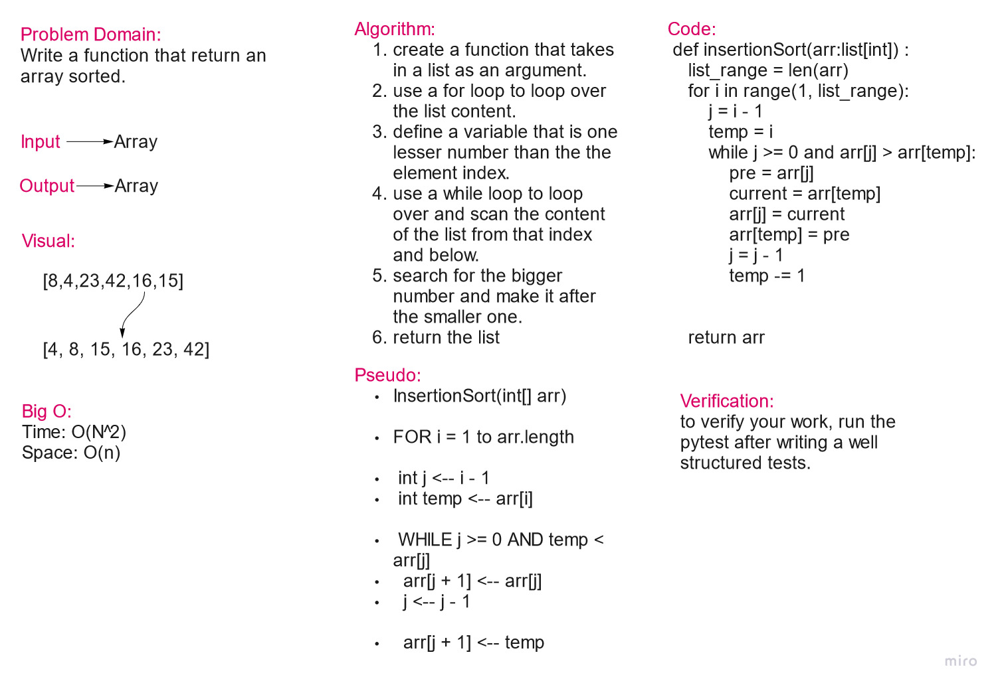

# Selection Sort

selection sort is an in-place comparison sorting algorithm. It has an O(n²) time complexity, which makes it inefficient on large lists, and generally performs worse than the similar insertion sort.

* **Big O**

* Time: O(n^2)
* Space: O(n)

## Pseudo Code

    SelectionSort(int[] arr)
        DECLARE n <-- arr.Length;
        FOR i = 0; i to n - 1
            DECLARE min <-- i;
            FOR j = i + 1 to n
                if (arr[j] < arr[min])
                    min <-- j;

            DECLARE temp <-- arr[min];
            arr[min] <-- arr[i];
            arr[i] <-- temp;

## Implemented Code [tested]

    def insertionSort(arr:list[int]) :
        list_range = len(arr)
        for i in range(1, list_range):
            j = i - 1
            temp = i
            while j >= 0 and arr[j] > arr[temp]:
                pre = arr[j]
                current = arr[temp]
                arr[j] = current
                arr[temp] = pre
                j = j - 1
                temp -= 1

        return arr

## White Board:

