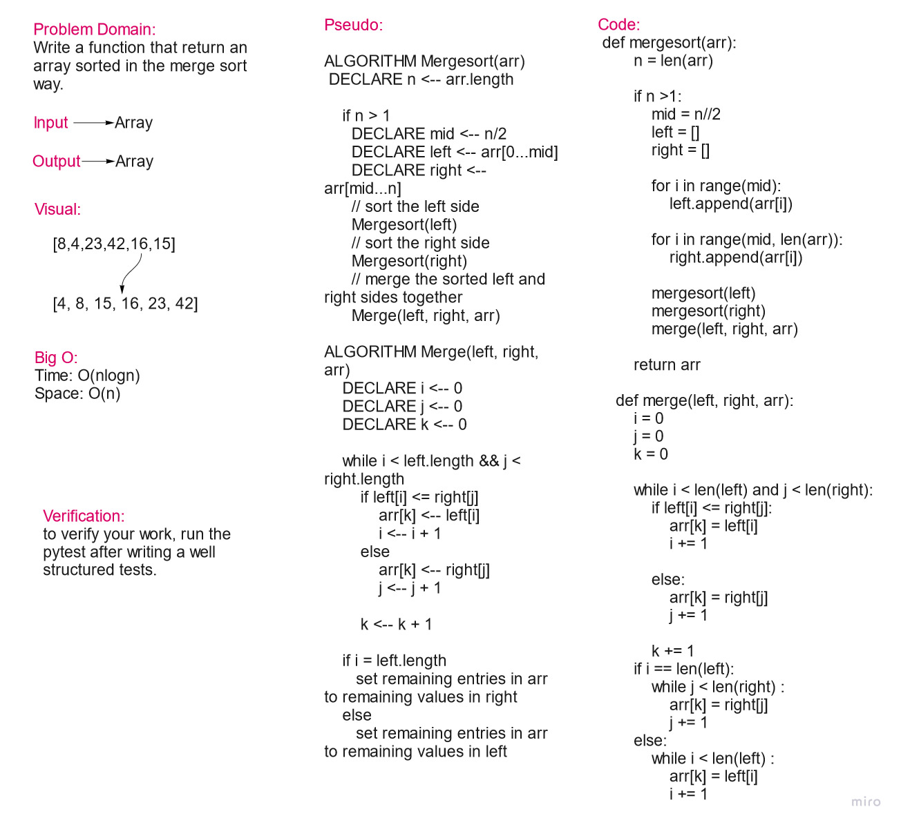

# Merge Sort

In computer science, merge sort is an efficient, general-purpose, and comparison-based sorting algorithm. Most implementations produce a stable sort, which means that the order of equal elements is the same in the input and output.

## Pseudo Code

    ALGORITHM Mergesort(arr)
        DECLARE n <-- arr.length

        if n > 1
        DECLARE mid <-- n/2
        DECLARE left <-- arr[0...mid]
        DECLARE right <-- arr[mid...n]
        // sort the left side
        Mergesort(left)
        // sort the right side
        Mergesort(right)
        // merge the sorted left and right sides together
        Merge(left, right, arr)

    ALGORITHM Merge(left, right, arr)
        DECLARE i <-- 0
        DECLARE j <-- 0
        DECLARE k <-- 0

        while i < left.length && j < right.length
            if left[i] <= right[j]
                arr[k] <-- left[i]
                i <-- i + 1
            else
                arr[k] <-- right[j]
                j <-- j + 1

            k <-- k + 1

        if i = left.length
        set remaining entries in arr to remaining values in right
        else
        set remaining entries in arr to remaining values in left

## Time & Space Efficiency:

Big O:

* Time: O(nlogn)
* Space: O(n)

## solution:

    def mergesort(arr):
            n = len(arr)

            if n >1:
                mid = n//2
                left = []
                right = []

                for i in range(mid):
                    left.append(arr[i])

                for i in range(mid, len(arr)):
                    right.append(arr[i])

                mergesort(left)
                mergesort(right)
                merge(left, right, arr)

            return arr

        def merge(left, right, arr):
            i = 0
            j = 0
            k = 0

            while i < len(left) and j < len(right):
                if left[i] <= right[j]:
                    arr[k] = left[i]
                    i += 1

                else:
                    arr[k] = right[j]
                    j += 1

                k += 1
            if i == len(left):
                while j < len(right) :
                    arr[k] = right[j]
                    j += 1
            else:
                while i < len(left) :
                    arr[k] = left[i]
                    i += 1

## Whiteboard:

