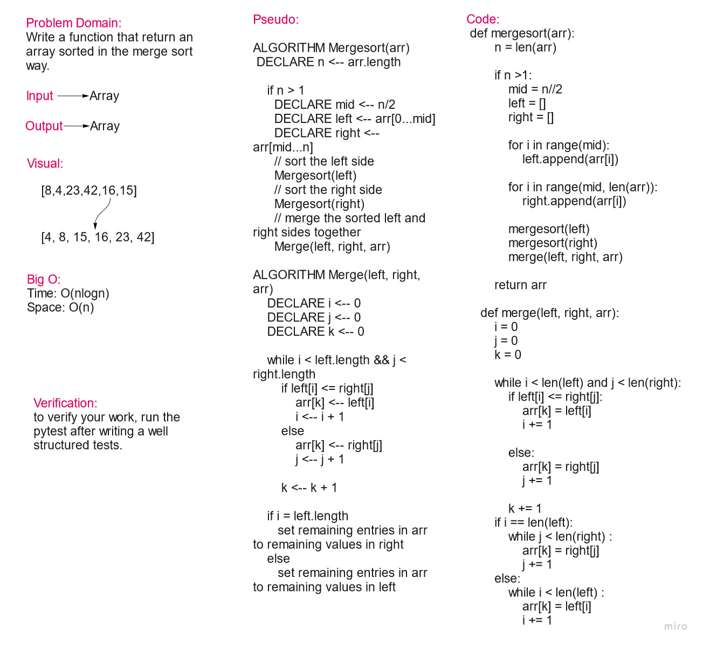

# Challenge Summary

Write a merge sort function that sorts an array in the merge sort way

## Whiteboard Process

## Approach & Efficiency

The approach of functions was used.

Big O:

* Time: O(nlogn)
* Time: O(n)

## Solution

    def mergesort(arr):
        n = len(arr)

        if n >1:
            mid = n//2
            left = []
            right = []

            for i in range(mid):
                left.append(arr[i])

            for i in range(mid, len(arr)):
                right.append(arr[i])

            mergesort(left)
            mergesort(right)
            merge(left, right, arr)

        return arr

    def merge(left, right, arr):
        i = 0
        j = 0
        k = 0

        while i < len(left) and j < len(right):
            if left[i] <= right[j]:
                arr[k] = left[i]
                i += 1

            else:
                arr[k] = right[j]
                j += 1

            k += 1
        if i == len(left):
            while j < len(right) :
                arr[k] = right[j]
                j += 1
        else:
            while i < len(left) :
                arr[k] = left[i]
                i += 1
