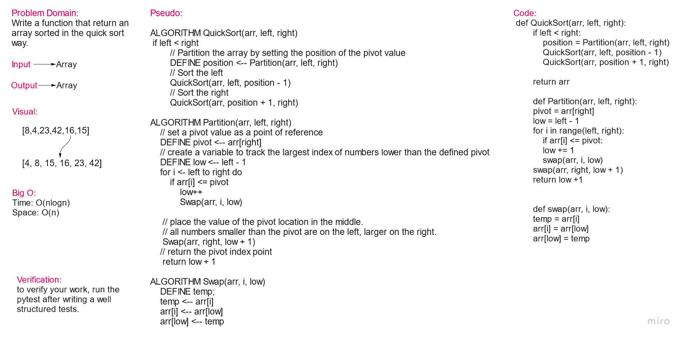

# Merge Sort

Quicksort is an in-place sorting algorithm. Developed by British computer scientist Tony Hoare in 1959 and published in 1961, it is still a commonly used algorithm for sorting. When implemented well, it can be somewhat faster than merge sort and about two or three times faster than heapsort.

## Pseudo Code

    ALGORITHM QuickSort(arr, left, right)
    if left < right
        // Partition the array by setting the position of the pivot value
        DEFINE position <-- Partition(arr, left, right)
        // Sort the left
        QuickSort(arr, left, position - 1)
        // Sort the right
        QuickSort(arr, position + 1, right)

    ALGORITHM Partition(arr, left, right)
        // set a pivot value as a point of reference
        DEFINE pivot <-- arr[right]
        // create a variable to track the largest index of numbers lower than the defined pivot
        DEFINE low <-- left - 1
        for i <- left to right do
            if arr[i] <= pivot
                low++
                Swap(arr, i, low)

        // place the value of the pivot location in the middle.
        // all numbers smaller than the pivot are on the left, larger on the right.
        Swap(arr, right, low + 1)
        // return the pivot index point
        return low + 1

    ALGORITHM Swap(arr, i, low)
        DEFINE temp;
        temp <-- arr[i]
        arr[i] <-- arr[low]
        arr[low] <-- temp

## Time & Space Efficiency:

Big O:

* Time: O(nlogn)
* Space: O(n)

## solution:

    def QuickSort(arr, left, right):
        if left < right:
            position = Partition(arr, left, right)
            QuickSort(arr, left, position - 1)
            QuickSort(arr, position + 1, right)

        return arr

        def Partition(arr, left, right):
        pivot = arr[right]
        low = left - 1
        for i in range(left, right):
            if arr[i] <= pivot:
            low += 1
            swap(arr, i, low)
        swap(arr, right, low + 1)
        return low +1

        def swap(arr, i, low):
        temp = arr[i]
        arr[i] = arr[low]
        arr[low] = temp

## Whiteboard:

