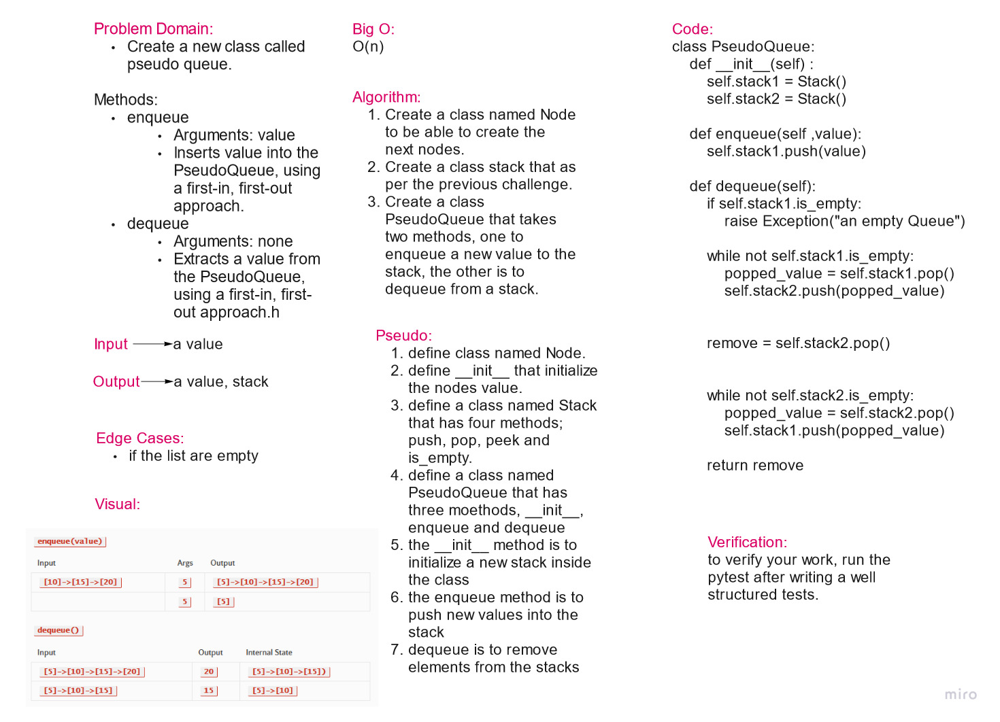

# Challenge Summary

Create a new class called pseudo queue.

    Do not use an existing Queue.
    Instead, this PseudoQueue class will implement our standard queue interface (the two methods listed below),
    Internally, utilize 2 Stack instances to create and manage the queue

## Whiteboard Process

## Approach & Efficiency

The approach used here is to create classes and methods

## Solution

class PseudoQueue:
    def __init__(self) :
        self.stack1 = Stack()
        self.stack2 = Stack()

    def enqueue(self ,value):
        self.stack1.push(value)

    def dequeue(self):
        if self.stack1.is_empty:
            raise Exception("an empty Queue")

        while not self.stack1.is_empty:
            popped_value = self.stack1.pop()
            self.stack2.push(popped_value)

        remove = self.stack2.pop()

        while not self.stack2.is_empty:
            popped_value = self.stack2.pop()
            self.stack1.push(popped_value)

        return remove
