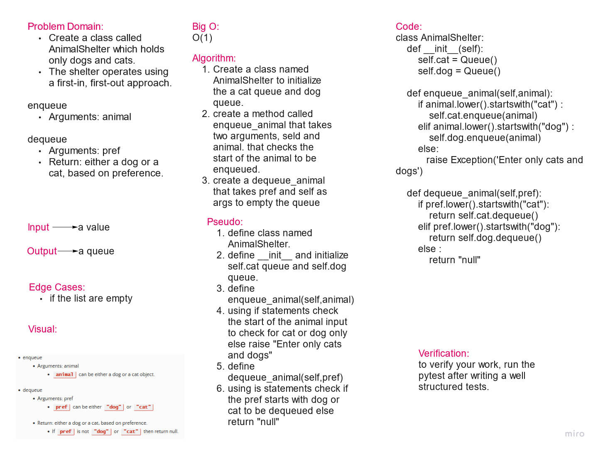

# Challenge Summary

Create a class called AnimalShelter which holds only dogs and cats.
The shelter operates using a first-in, first-out approach.

## Whiteboard Process

## Approach & Efficiency

The approach used here is to create classes and methods

Big O = O(1)

## Solution

    class AnimalShelter:
        def __init__(self):
            self.cat = Queue()
            self.dog = Queue()

        def enqueue_animal(self,animal):
            if animal.lower().startswith("cat") :
                self.cat.enqueue(animal)
            elif animal.lower().startswith("dog") :
                self.dog.enqueue(animal)
            else:
            raise Exception('Enter only cats and dogs')

        def dequeue_animal(self,pref):
            if pref.lower().startswith("cat"):
                return self.cat.dequeue()
            elif pref.lower().startswith("dog"):
                return self.dog.dequeue()
            else :
                return "null"
