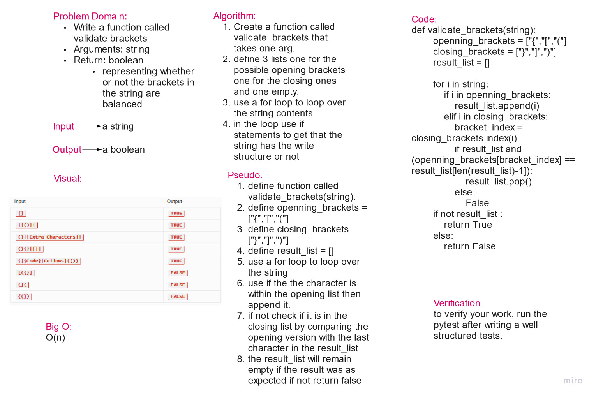

# Challenge Summary

Write a function called validate brackets
Arguments: string
Return: boolean
    representing whether or not the brackets in the string are balanced

## Whiteboard Process

## Approach & Efficiency

Aproach of functions used.

Big O = O(n)

## Solution

    def validate_brackets(string):
        openning_brackets = ["{","[","("]
        closing_brackets = ["}","]",")"]
        result_list = []

        for i in string:
            if i in openning_brackets:
                result_list.append(i)
            elif i in closing_brackets:
                bracket_index = closing_brackets.index(i)
                if result_list and (openning_brackets[bracket_index] == result_list[len(result_list)-1]):
                    result_list.pop()
                else :
                    False
        if not result_list :
            return True
        else:
            return False
