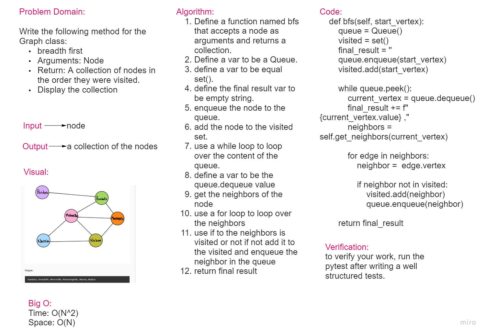

# Graphs

In computer science, a graph is an abstract data type that is meant to implement the undirected graph and directed graph concepts from the field of graph theory within mathematics.

**############# Code Challenge 37 #############**

## Challenge Summary

Given a business trip itinerary, and an Alaska Airlines route map, is the trip possible with direct flights? If so, how much will the total trip cost be?

* Write a function called business trip
* Arguments: graph, array of city names
* Return: cost or null

### Whiteboard Process

### Approach & Efficiency

The approach of using a function were used.

Big O:

* Time: O(n^2)
* Space: O(n)

### Solution

     def business_trip(graph ,city_names):
    total_cost = 0
    def rec(city_names):
        nonlocal total_cost
        city = city_names.pop(0)
        cities = graph.get_neighbors(city)
        vertex = [city.vertex for city in cities]
        city_list =[]
        for city in cities:
          city_one = city.vertex
          city_list.append(city_one.value)
        for city in city_names:
            if city.value not in city_list:
                return "False, $0"
        for city in cities:
            if city_names[0] not in vertex:
                return "False, $0"
            if city.vertex in city_names:
                total_cost += city.weight
                if len(city_names)>1 :
                    rec(city_names)
    rec(city_names)
    if not total_cost:
        return "False, $0"
    res = f"True, ${total_cost}"
    return res

**############# Code Challenge 36 #############**

## Challenge Summary

Write the following method for the Graph class:

* breadth first
* Arguments: Node
* Return: A collection of nodes in the order they were visited.
* Display the collection

### Whiteboard Process

### Approach & Efficiency

The approach of using a function were used.

Big O:
* Time: O(n^2)
* Space: O(n)

### Solution

    def bfs(self, start_vertex):
        queue = Queue()
        visited = set()
        final_result = ''
        queue.enqueue(start_vertex)
        visited.add(start_vertex)

        while queue.peek():
            current_vertex = queue.dequeue()
            final_result += f"{current_vertex.value} ,"
            neighbors = self.get_neighbors(current_vertex)

            for edge in neighbors:
                neighbor =  edge.vertex

                if neighbor not in visited:
                    visited.add(neighbor)
                    queue.enqueue(neighbor)

        return final_result

**############# Code Challenge 35 #############**

## Challenge

Implement your own Graph. The graph should be represented as an adjacency list, and should include the following methods:

* add node
* add edge
* get nodes
* get neighbors
* size

## Approach & Efficiency

The approach of using classes and methods were used

Big O:

* add node:
    * Time: O(1)
    * Space: O(n)

* add edge:
    * Time: O(1)
    * Space: O(1)

* get nodes:
    * Time: O(1)
    * Space: O(1)

* get neighbors:
    * Time: O(1)
    * Space: O(1)

* size:
    * Time: O(1)
    * Space: O(1)

## API

* add node: adds a node to the graph
* add edge: adds a connection to the node
* get nodes: gets all the nodes in the graph as a collection
* get neighbors: gets a collection of edges connected to the given node
* size: returns the total number of nodes in the graph
