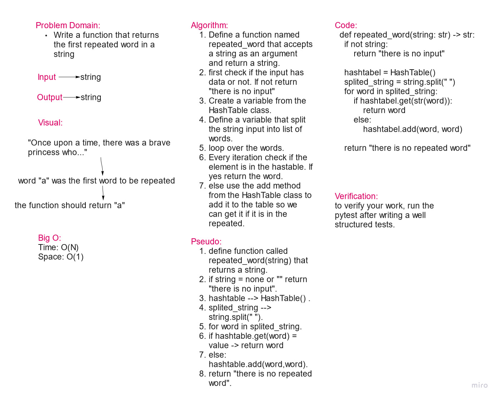

# Hashtables

In computing, a hash table is a data structure that implements an associative array abstract data type, a structure that can map keys to values. A hash table uses a hash function to compute an index, also called a hash code, into an array of buckets or slots, from which the desired value can be found.

**##################### Challenge 31 ################**

## Challenge Summary

Find the first repeated word in a book.

## Whiteboard Process

## Approach & Efficiency

The approach of creating a function was used.

Big O:

* Time: O(n)
* Space: O(1)

## Solution

    def repeated_word(string: str) -> str:
        if not string:
            return "there is no input"

        hashtabel = HashTable()
        splited_string = string.split(" ")
        for word in splited_string:
            if hashtabel.get(str(word)):
                return word
            else:
                hashtabel.add(word, word)

        return "there is no repeated word"

**##################### Challenge 30 ###############**

## Challenge

An implementation for a hashtable with its functions.

## Approach & Efficiency

The approach of classes and methods were used.

Big O:

* Time: O(n)
* Space: O(n)

## API

* add: has the key, add teh key and value pair to the table.
* get: gets the value that is associated with a key in the table.
* contains: returns true if the key exists in the table and false if not.
* hash: gives the index in which the key has to be added along with the value.
