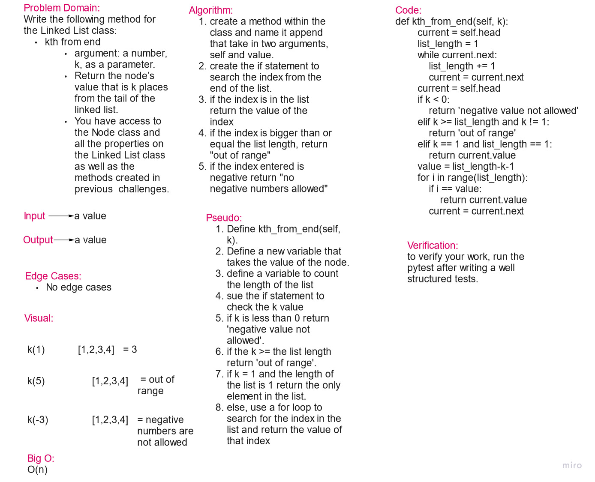

# Challenge Summary

write a method that gets the kth element of the list but from the end.

## Whiteboard Process

## Approach & Efficiency

The approach is to use methods only to achieve the requirements.
Big O = O(n)

## Solution

[code link](linked_list_challenge.py)

def kth_from_end(self, k):
        current = self.head
        list_length = 1
        while current.next:
            list_length += 1
            current = current.next
        current = self.head
        if k < 0:
            return 'negative value not allowed'
        elif k >= list_length and k != 1:
            return 'out of range'
        elif k == 1 and list_length == 1:
            return current.value
        value = list_length-k-1
        for i in range(list_length):
            if i == value:
                return current.value
            current = current.next
