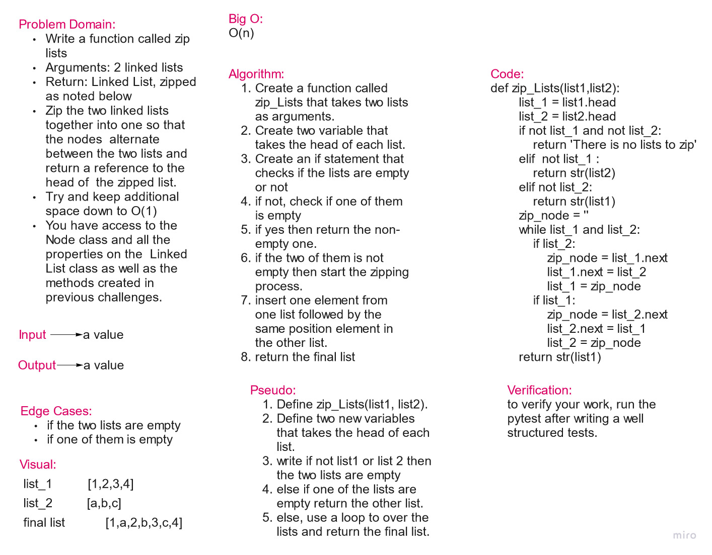

# Challenge Summary

write a method that takes to lists and merge them in a zip way, e.g. [1,2,3,4] and [a,b,c] => [1,a,2,b,3,c,4].

## Whiteboard Process

## Approach & Efficiency

The approach is to use methods only to achieve the requirements.
Big O = O(n)

## Solution

[code link](linked_list_challenge.py)

    def zip_Lists(list1,list2):
        list_1 = list1.head
        list_2 = list2.head
        if not list_1 and not list_2:
            return 'There is no lists to zip'
        elif  not list_1 :
            return str(list2)
        elif not list_2:
            return str(list1)
        zip_node = ''
        while list_1 and list_2:
            if list_2:
                zip_node = list_1.next
                list_1.next = list_2
                list_1 = zip_node
            if list_1:
                zip_node = list_2.next
                list_2.next = list_1
                list_2 = zip_node
        return str(list1)
