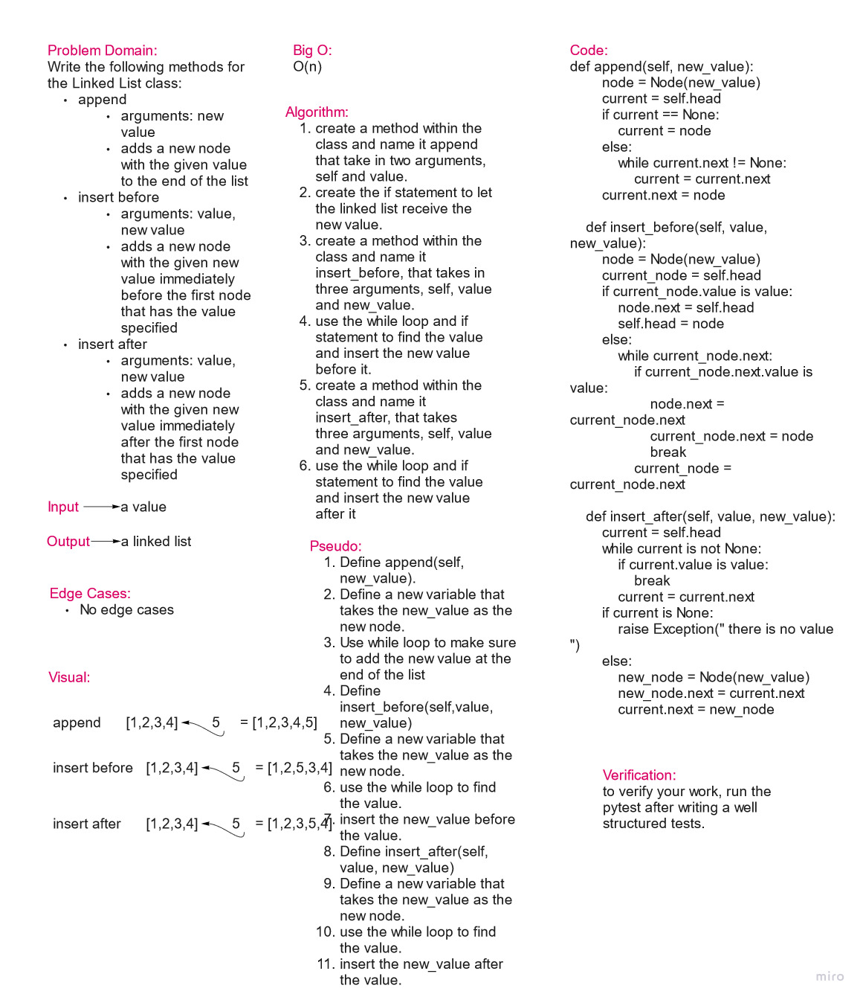

# Challenge Summary

Write three methods to append a new value to the end of a list, insert a new value after already-existing value, insert a new value before already-existing value.

## Whiteboard Process

## Approach & Efficiency

The approach is to use methods only to achieve the requirements.
Big O = O(n)

## Solution

[code link](linked_list_challenge.py)

def append(self, new_value):
        node = Node(new_value)
        current = self.head
        if current == None:
            current = node
        else:
            while current.next != None:
                current = current.next
        current.next = node

def insert_before(self, value, new_value):
        node = Node(new_value)
        current_node = self.head
        if current_node.value is value:
            node.next = self.head
            self.head = node
        else:
            while current_node.next:
                if current_node.next.value is value:
                    node.next = current_node.next
                    current_node.next = node
                    break
                current_node = current_node.next

def insert_after(self, value, new_value):
        current = self.head
        while current is not None:
            if current.value is value:
                break
            current = current.next
        if current is None:
            raise Exception(" there is no value ")
        else:
            new_node = Node(new_value)
            new_node.next = current.next
            current.next = new_node
