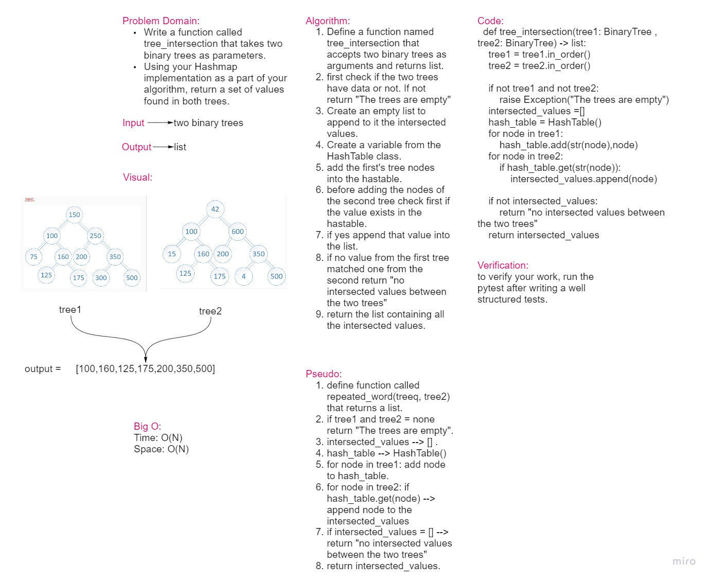

# Challenge Summary

* Write a function called tree_intersection that takes two binary trees as parameters.
* Using your Hashmap implementation as a part of your algorithm, return a set of values found in both trees.

## Whiteboard Process

## Approach & Efficiency

The approach of creating a function were used.

Big O:

* Time = O(n)
* Space = O(n)

## Solution

    def tree_intersection(tree1: BinaryTree , tree2: BinaryTree) -> list:
        tree1 = tree1.in_order()
        tree2 = tree2.in_order()

        if not tree1 and not tree2:
            raise Exception("The trees are empty")
        intersected_values =[]
        hash_table = HashTable()
        for node in tree1:
            hash_table.add(str(node),node)
        for node in tree2:
            if hash_table.get(str(node)):
                intersected_values.append(node)

        if not intersected_values:
            return "no intersected values between the two trees"
        return intersected_values
