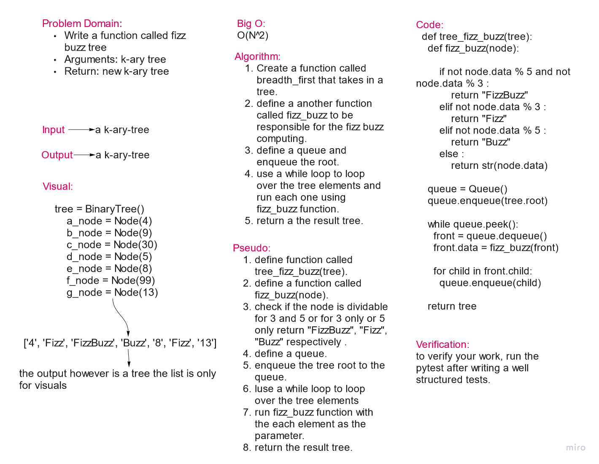
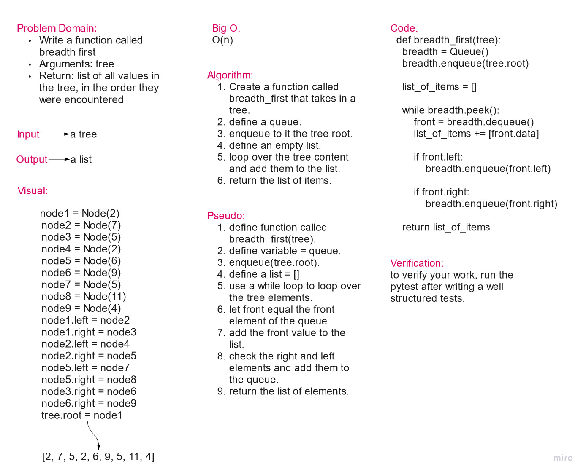
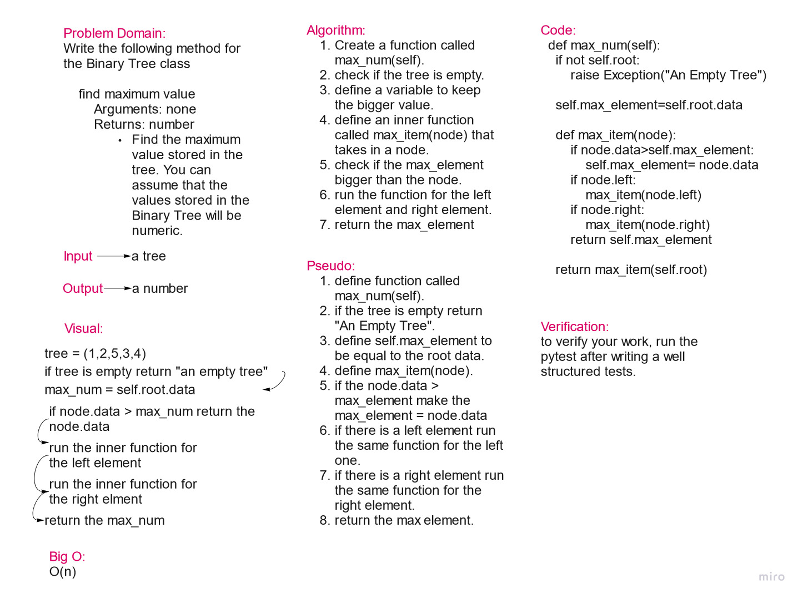

*Please find below each code challenge, in the tree section, details. Code challenge 15, 16, 17 and 18.*

**////////////////////////Code Challenge 18///////////////**
# Breadth First (challenge 17)

# Challenge Summary

    Write a function called fizz buzz tree
    Arguments: k-ary tree
    Return: new k-ary tree

## Whiteboard Process

## Approach & Efficiency

The approach of creating a function was used.

## Solution

    def tree_fizz_buzz(tree):
        def fizz_buzz(node):

            if not node.data % 5 and not node.data % 3 :
                return "FizzBuzz"
            elif not node.data % 3 :
                return "Fizz"
            elif not node.data % 5 :
                return "Buzz"
            else :
                return str(node.data)

    queue = Queue()
    queue.enqueue(tree.root)

    while queue.peek():
      front = queue.dequeue()
      front.data = fizz_buzz(front)

      for child in front.child:
        queue.enqueue(child)

    return tree

**////////////////////////Code Challenge 17///////////////**
# Breadth First (challenge 17)

# Challenge Summary

    Write a function called breadth first
    Arguments: tree
    Return: list of all values in the tree, in the order they were encountered

## Whiteboard Process

## Approach & Efficiency

The approach of creating a function was used.

## Solution

    def breadth_first(tree):
    breadth = Queue()
    breadth.enqueue(tree.root)

    list_of_items = []

    while breadth.peek():
        front = breadth.dequeue()
        list_of_items += [front.data]

        if front.left:
            breadth.enqueue(front.left)

        if front.right:
            breadth.enqueue(front.right)

    return list_of_items

**////////////////////////Code Challenge 16///////////////**
# Tree max (challenge 16)

# Challenge Summary

Write the following method for the Binary Tree class

    find maximum value
    Arguments: none
    Returns: number

Find the maximum value stored in the tree. You can assume that the values stored in the Binary Tree will be numeric.

# Whiteboard Process <!-- challenge 16 -->

## Approach & Efficiency

The approach of creating a method was used.

## Solution

    def max_num(self):
        if not self.root:
            raise Exception("An Empty Tree")

        self.max_element=self.root.data

        def max_item(node):
            if node.data>self.max_element:
                self.max_element= node.data
            if node.left:
                max_item(node.left)
            if node.right:
                max_item(node.right)
            return self.max_element

        return max_item(self.root)

**////////////////////////Code Challenge 15///////////////**
# Trees

Create a Binary tree and a Binary Search tree.

## Challenge

Node

    Create a Node class that has properties for the value stored in the node, the left child node, and the right child node.

Binary Tree

    Create a Binary Tree class
        Define a method for each of the depth first traversals:
            pre order
            in order
            post order which returns an array of the values, ordered appropriately.
    Any exceptions or errors that come from your code should be semantic, capture-able errors. For example, rather than a default error thrown by your language, your code should raise/throw a custom, semantic error that describes what went wrong in calling the methods you wrote for this lab.

Binary Search Tree

    Create a Binary Search Tree class
        This class should be a sub-class (or your languages equivalent) of the Binary Tree Class, with the following additional methods:
        Add
            Arguments: value
            Return: nothing
            Adds a new node with that value in the correct location in the binary search tree.
        Contains
            Argument: value
            Returns: boolean indicating whether or not the value is in the tree at least once.

## Approach & Efficiency

Classes and methods are used to solve this challenge.

Big O= O(n)

## API

* pre order: to create a tree in the pre-order style. It would look like this: ["1", "2", "4", "3"], which may look a lot like the ordenary style and order.
* in order: which look like this: ["4", "2", "1", "3"].
* post order: ["4", "2", "3", "1"], looks a lot deformed and twisted.
